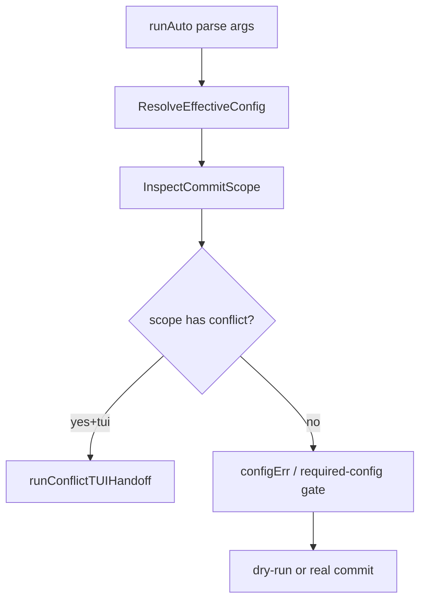
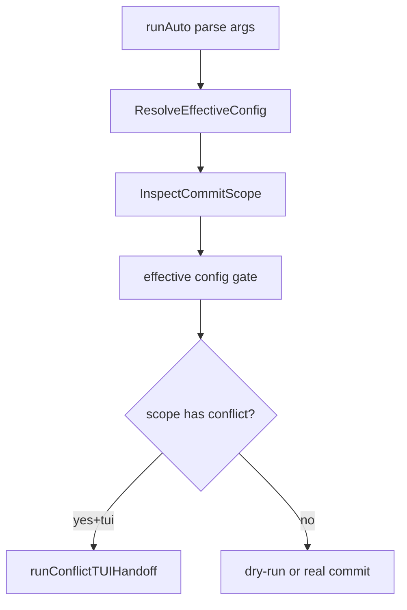

# config-repair-ux-hardening design

## 0. 术语约定

- **Config Panel**：`cnm config` 在 TTY 下进入的交互式偏好编辑界面。
- **Conflict Handoff**：`cnm auto --tui` 在发现冲突后，把用户切回 Full-screen TUI 并允许 Interactive Repair 的那条分支。
- **Effective Config Gate**：在进入 provider 创建、tool runtime 或 repair 之前，对 `ResolveEffectiveConfig` 和 required config 做统一前置校验。
- **Provider Slot**：Secret Store 中按 provider 维度区分的 API key 存储位置。

## 1. 决策与约束

### 1.1 要解决的问题

当前有两个高优先级 UX / correctness 缺口：

1. Config Panel 内如果用户先切换 provider，再设置 API key，key 会写入“打开 panel 时的旧 provider slot”，导致后续 effective config 与用户心智不一致。
2. `cnm auto --tui` 的 conflict handoff 分支会在统一 config gate 之前触发，导致“缺 API key / baseURL / config parse error”在冲突路径里被延后甚至被 provider 次生错误掩盖。

### 1.2 本次决策

- **把 provider 选择视为 Config Panel 的实时状态，而不是 panel 打开时的快照。** API key 写入必须基于“当前生效或刚编辑后的 provider”。
- **把 conflict handoff 视为 Autonomous Commit 的一种输出分支，不是 config gate 的旁路。** 只要 repair 最终仍依赖 provider，就必须先通过统一 config gate。
- **统一错误优先级**：配置解析失败 / 必要配置缺失，优先于 conflict repair / provider 创建错误对用户暴露。

### 1.3 明确不做

- 不在这次 feature 里重做整个 config schema 或 Secret Store 抽象。
- 不新增新的 provider 能力或 repair domain tool。
- 不改变 `git reset --mixed`、commit transaction、secret blocker 等已定提交主流程语义。
- 不把 `runAuto` 一次性完全重写；只做到足够支撑本 feature 的结构收敛。

### 1.4 复杂度档位

走默认产品复杂度档位；本次是现有 CLI/TUI/config flow 的确定性 hardening，不引入新外部系统或新命令面。

## 2. 名词与编排

### 2.1 名词层：现状 → 变化

#### 现状

- Config Panel 的写入接口由 `internal/cli/cli.go` 里的 `runConfigPanel` 注入，`WriteValue` / `UnsetValue` / `Reload` 通过闭包提供给 `internal/tui/config_panel.go`。
- 当前 `WriteValue` 在处理 `apiKey` 时使用 `resolved.Values.Provider` 作为写入目标；这个 `resolved` 只在 panel 启动时解析一次。
- `ResolveEffectiveConfig` 已经能给出 provider / apiKey / baseURL 等当前有效值以及 source summary。
- `runAuto` 已经有统一的 `configErr` / `autoRequiredConfigIssue` 检查，但 conflict + `--tui` 分支发生在这些检查之前。

#### 变化

- 引入 **panel 当前 provider 解析规则**：当 Config Panel 保存 `apiKey` 时，优先使用“本次编辑后可解析出的 provider”，而不是 panel 初始快照。
- 引入 **conflict handoff 前置 config gate**：冲突路径在进入 `runConflictTUIHandoff` 前，必须复用 normal auto path 的 config 检查结果。
- 对用户暴露的行为变成：
  - Config Panel：provider 改完再填 key，会把 key 存到新 provider slot。
  - `cnm auto --tui`：如果缺 key / 缺 baseURL / config 文件非法，先报 config 问题，不进入 repair。

### 2.2 编排层：现状 → 变化

#### 现状

- `runAuto` 里 conflict handoff 在统一 config gate 前面。
- Config Panel 写入 API key 时不重新解析 provider 状态。

#### 变化

- `runAuto` 先完成 config gate，再决定是否进入 conflict handoff。
- Config Panel 在 API key 保存时，先解析“最新 provider 目标”，再调用 Secret Store 写入。
- 错误优先级固定为：config parse / required config > conflict repair/provider runtime 次生错误。

### 2.3 挂载点清单

1. `internal/cli.runConfigPanel`：决定 Config Panel 的写入语义，删掉这里的调整，provider-aware API key 保存就消失。
2. `internal/config.ResolveEffectiveConfig` / source summary：为“当前 provider 目标”提供统一解析依据。
3. `internal/cli.runAuto`：决定 auto flow 的 config gate 与 conflict handoff 顺序。
4. `internal/cli.runConflictTUIHandoff`：依赖统一 gate 后的有效配置进入 repair。
5. `internal/cli` / `internal/config` tests：反向证明用户可观察行为已稳定。

### 2.4 推进策略

1. **编排骨架**：先收敛 `runAuto` 的前置检查顺序，把 config gate 从 conflict handoff 前显式抽出来。  
   退出信号：conflict + missing config 的 CLI tests 能稳定得到 config error，而不是 repair/provider 次生错误。
2. **配置写入节点**：重做 Config Panel 的 API key 保存目标解析，让 provider 以当前状态为准。  
   退出信号：先改 provider 再设 key 的测试能证明 key 落到新 provider slot。
3. **输出与错误语义**：统一 JSON / human output 下的 config-missing / config-error 表达，避免 TUI handoff 绕路。  
   退出信号：normal auto path 与 conflict + `--tui` path 的错误优先级一致。
4. **测试覆盖**：补 CLI/config/TUI 交叉场景测试，锁定 provider slot 与 conflict gate 顺序。  
   退出信号：新增回归测试通过，现有相关包测试继续全绿。

### 2.5 结构健康度与微重构

#### 文件级评估

- `internal/cli/cli.go` 已经承载多个命令面和多种输出分支，`runAuto` 约 200 行，是当前 feature 主要的结构风险点。
- `runConfigPanel` 本身不算超长，但其闭包式写入逻辑把“panel 当前状态”和“初始 resolved 快照”混在一起，容易形成状态错配。

#### 目录级评估

- `internal/cli/` 继续承担命令分派与 wiring，当前问题主要是函数内部分层不够，而不是目录组织错误。
- `internal/config/` 的职责边界仍然清晰；本 feature 不需要重组目录。

#### 结论

**做轻量微重构（拆文件/拆 helper 级别，不做目录重组）。**

- 对 `runAuto`：允许抽出小 helper（如 config gate / conflict gate / result writer），但不做跨包重构。
- 对 Config Panel 写入：允许把“解析当前 provider 再写 Secret Store”提成显式 helper，避免继续依赖闭包快照。

#### 超出范围的观察

- `runAuto` 的整体状态机仍偏胖，未来最好单独走 `cs-refactor` 做更完整的 phase 化拆分。
- `ConfigPanelInput` 目前主要靠回调注入状态，长期看可考虑把“临时编辑状态”建模得更显式，但这不是本次 feature 前置。

## 3. 验收契约

1. **Config Panel provider 切换后设 key**  
   输入 / 触发：用户在 `cnm config` panel 中先把 provider 从 A 改为 B，再输入 API key 并保存。  
   期望结果：Secret Store key 写入 B 的 slot；后续解析 effective config 时，B 被识别为有 key，A 不会因为这次写入意外获得新 key。

2. **Conflict + TUI + 缺 API key**  
   输入 / 触发：`cnm auto --tui` 遇到 conflict，同时当前 provider 缺 API key。  
   期望结果：命令在进入 repair 前就给出稳定的 config-missing / api-key-missing 错误，不进入 repair handoff。

3. **Conflict + TUI + openai-compatible 缺 baseURL**  
   输入 / 触发：`cnm auto --tui` 遇到 conflict，provider 为 `openai-compatible` 且无 `baseURL`。  
   期望结果：用户收到 `base_url_missing` 类错误，行为与 non-conflict auto path 一致。

4. **正常 conflict repair 不回归**  
   输入 / 触发：`cnm auto --tui` 遇到 conflict，且 provider 配置完整。  
   期望结果：仍可正常进入 Interactive Repair → commit handoff，不改变现有 happy path。

5. **明确不做反向核对**  
   输入 / 触发：查看本次 diff。  
   期望结果：没有新增 provider 能力、没有改 Secret Store backend、没有把 `cnm auto` 拆成新的命令面。

## 4. 与项目级架构文档的关系

本 feature 改动主要落在现有 CLI 调度层与 config/repair 边界内部，系统级架构不新增模块，但 acceptance 后应考虑把以下约束提炼回 `ARCHITECTURE.md`：

- Config Panel 中“API key 依赖当前 provider 状态”的规则，属于配置写入边界的一部分。
- Conflict handoff 不是 config gate 的旁路；repair 仍属于 provider-dependent flow 的稳定约束。

如果最终实现只是 helper 级修正且没有新增稳定约束，可在 acceptance 阶段判定“无需回写 architecture，只保留 feature 归档”。