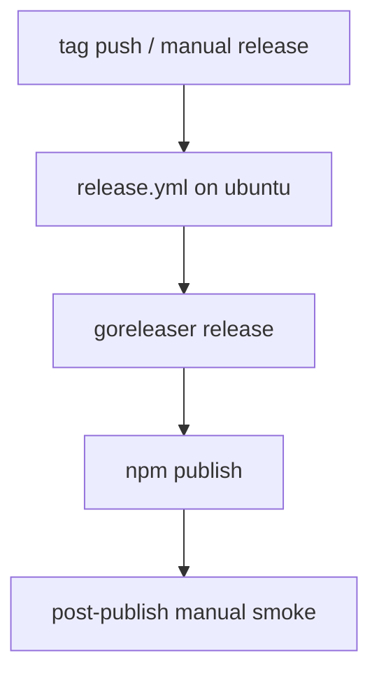
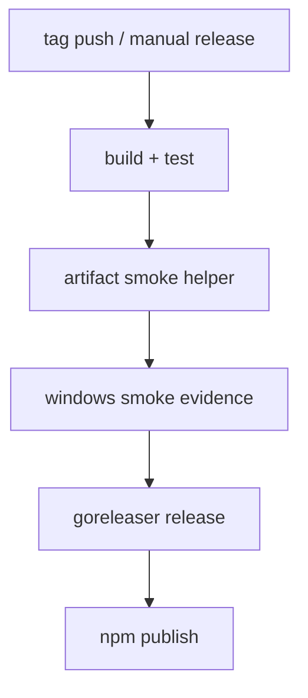

# windows-installer-wrapper-smoke-coverage design

## 0. 术语约定

- **Windows Installer**：`scripts/npm-install.js` 在 Windows 平台下载 release archive、校验 checksum、解压并把 `cnm.exe` 安装进 `bin/` 的路径。
- **Wrapper**：`scripts/cnm.js`，负责寻找已安装或本地构建的 native binary 并执行。
- **Smoke Coverage**：不是深度业务测试，而是验证“发布链关键步骤能跑通”的轻量自动检查。
- **Release Artifact Contract**：由 `.goreleaser.yml`、`docs/distribution.md` 和 `scripts/npm-install.js` 共同约定的 archive 命名、压缩格式和安装前置条件。

## 1. 决策与约束

### 1.1 要解决的问题

当前 release hardening 已经补了 release workflow、runbook 和 checksum verification，但 Windows 方向仍缺一块关键证据：

1. CI / release workflow 还没有自动证明 `windows` 平台的 archive 命名、zip 路径、checksum 校验和解压分支真的能按预期跑通。
2. `scripts/npm-install.js` 的 Windows 分支依赖 `Expand-Archive` 和 `.zip` 产物契约，如果这条链断了，Linux/macOS smoke 也发现不了。
3. `scripts/cnm.js` 只是薄 wrapper，但发布后 Windows 用户真正接触到的是“installer + wrapper + `cnm.exe`”这一整条组合链，当前自动化覆盖还不够直接。

### 1.2 本次决策

- **把 Windows smoke coverage 视为 release/distribution 能力的一部分，而不是额外平台支持功能。** 目标是验证现有契约，而不是发明新的安装方式。
- **优先做可复用的自动 smoke primitive，再把它挂进 CI / release workflow。** 不把 Windows 验证逻辑散写在 workflow shell 里。
- **验证重点放在产物契约和启动路径，而不是业务功能本身。** 只要能证明 zip archive、checksum、extract、wrapper launch 成立，就达到本 feature 目标。

### 1.3 明确不做

- 不新增 MSI / winget / Scoop 等新的 Windows 分发面。
- 不把 release workflow 扩成矩阵级跨平台端到端安装实验室。
- 不在本 feature 中重写 installer / wrapper 的整体架构，只补 smoke coverage 和必要的小接口抽取。
- 不把发布流程变成需要真实 `npm publish` 才能验证的强依赖。

### 1.4 复杂度档位

走默认产品复杂度档位；本次属于发布链 hardening 和 CI 收尾，不引入新的外部产品能力。

## 2. 名词与编排

### 2.1 名词层：现状 → 变化

#### 现状

- `.goreleaser.yml` 已定义 Windows archive 为 `.zip`，且 release workflow 会在 tag 发布时调用 GoReleaser。
- `scripts/npm-install.js` 已能根据平台选择 `.zip` / `.tar.gz`，下载 archive 与 `checksums.txt`，校验 checksum，再按平台解压。
- `scripts/cnm.js` 只验证 binary 是否存在并执行，不感知 release archive 细节。
- CI 目前只在 Linux runner 上跑 `npm test`、`make go-build`、`npm pack --dry-run`；release workflow 也主要在 Ubuntu runner 上执行。

#### 变化

- 引入 **Windows smoke fixture / helper**：提供对 `.zip` archive、checksum 文件、`cnm.exe` 落位和 wrapper 启动路径的可自动验证证据。
- 引入 **Windows smoke step** 到 workflow：至少在 release 链里显式验证 Windows artifact contract，而不是只靠静态命名约定。
- 明确 **smoke contract**：
  - archive 名称必须符合 `commit-now-myfriend_<version>_windows_<arch>.zip`
  - `checksums.txt` 必须包含同名条目
  - installer Windows 分支能从 zip 中找到 `cnm.exe`
  - wrapper 对 `cnm.exe --help` 路径有可观察成功结果或明确失败信息

### 2.2 编排层：现状 → 变化

#### 现状

- Windows 契约目前主要靠 GoReleaser 配置、Node helper 单测和人工 runbook 约束。
- workflow 没有独立的 Windows smoke 节点去验证 zip/extract/launcher 组合行为。

#### 变化

- 在发布前加入可重复的 Windows smoke 检查。
- smoke 检查先验证 artifact contract，再验证 wrapper 启动路径。
- workflow 只消费 helper / script 输出，不把平台细节硬编码成大量 YAML shell 逻辑。

### 2.3 挂载点清单

1. `.github/workflows/ci.yml`：决定 PR/merge 前是否收集 Windows smoke 证据。
2. `.github/workflows/release.yml`：决定 tag 发布前是否验证 Windows artifact contract。
3. `scripts/npm-install.js` / `scripts/npm-install-lib.js`：提供 installer 行为的可测试边界。
4. `scripts/cnm.js`：作为 wrapper smoke 的真实启动入口。
5. `docs/distribution.md` / `docs/release-runbook.md`：承载“Windows smoke 现在由什么自动化保证”的对外说明。

### 2.4 推进策略

1. **编排骨架**：先抽出足够承载 Windows smoke 的 helper / test seam，避免 workflow 直接依赖大量内联 shell。  
   退出信号：Windows archive naming / checksum / launcher 路径可被脚本或测试独立验证。
2. **installer / wrapper smoke 节点**：补充 Windows 方向的 smoke test 或脚本，证明 zip + checksum + `cnm.exe` 路径成立。  
   退出信号：本地 / CI 可稳定跑出 Windows smoke 通过证据。
3. **workflow 接入**：把 Windows smoke 挂到 CI 或 release workflow 中，确保发布前自动执行。  
   退出信号：workflow YAML 中有明确 Windows smoke step，且与 helper 接口对齐。
4. **文档同步**：把自动 smoke 现状回写到 distribution / runbook。  
   退出信号：文档与 workflow / script 实际行为一致。

### 2.5 结构健康度与微重构

#### 文件级评估

- `scripts/npm-install.js` 正在从单文件脚本慢慢长出更多责任（下载、校验、解压、定位 binary）；继续补 smoke coverage 时，若不抽 seam，测试会越来越依赖端到端 shell。
- `.github/workflows/release.yml` 已经承担较多发布逻辑，如果直接把 Windows 细节继续内联进去，可读性会快速下降。

#### 目录级评估

- `scripts/` 目前已自然承载 installer/wrapper/release helper；继续加 Windows smoke helper 落这里是合理的。
- `.github/workflows/` 文件数少，不需要重组目录。

#### 结论

**做轻量微重构（helper 级拆分，不做目录重组）。**

- 允许在 `scripts/` 下新增 smoke helper / test 文件。
- workflow 只调用 helper，不直接内嵌复杂平台逻辑。

#### 超出范围的观察

- 如果以后需要真实 Windows runner 上的全链路安装验证，可能会演变成更大的 CI matrix / artifact promotion 设计，但这不属于本次 feature 前置。

## 3. 验收契约

1. **Windows archive contract**  
   输入 / 触发：运行 Windows smoke helper / 测试。  
   期望结果：验证 `windows_amd64.zip` / `windows_arm64.zip` 命名与 checksum 条目一致。

2. **Windows installer branch**  
   输入 / 触发：对 Windows 平台分支运行 installer smoke。  
   期望结果：zip archive、checksum verification、`cnm.exe` 定位逻辑都有可观察通过证据。

3. **Windows wrapper launch path**  
   输入 / 触发：对 `scripts/cnm.js` 的 Windows binary 选择路径做 smoke。  
   期望结果：wrapper 能找到 `cnm.exe`，并给出成功执行或明确错误信息。

4. **Workflow integration**  
   输入 / 触发：查看 CI / release workflow。  
   期望结果：Windows smoke 不再只是 runbook 里的人工步骤，而是自动化的一部分。

5. **明确不做反向核对**  
   输入 / 触发：查看本次 diff。  
   期望结果：没有新增 MSI/winget 等分发面，没有把发布流程改成必须真实发 npm 才能验证。

## 4. 与项目级架构文档的关系

本 feature 不改变系统主运行时架构，但 acceptance 后应评估是否把下面两点提炼回 `ARCHITECTURE.md`：

- release/distribution 边界现在不只依赖 runbook，还包含自动 Windows smoke coverage
- npm wrapper / installer 的“artifact contract + smoke evidence”成为分发链稳定约束的一部分

如果最终改动仅限 workflow 和 docs，可在 acceptance 阶段判定“不需要额外回写 architecture，只更新 distribution docs / runbook 即可”。