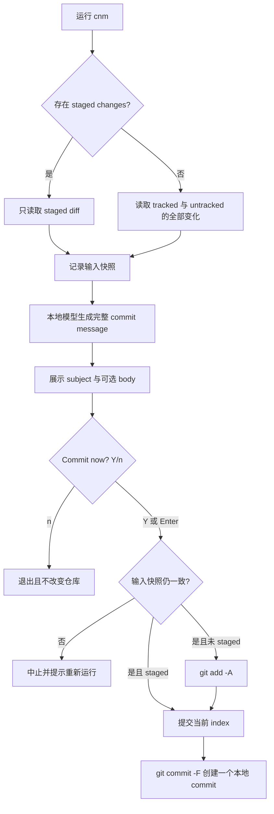

# 离线单流程提交

## 这个 Epic 要改变什么

把 `cnm` 从远程 AI 驱动的提交规划平台收缩为一个完全离线、只负责生成并确认提交消息的日常工具。用户只运行 `cnm`：工具选择当前应提交的 diff，用随发行物交付的本地小模型生成 commit message，展示完整消息，并在用户确认后创建一个本地 commit。

这条变化会替换 Full-screen TUI、Autonomous Commit、Tool Call Loop、多 Provider、提交拆分、修复、doctor/onboarding 和自建配置系统，不保留这些能力的兼容入口。

## 为什么现在做

当前实现围绕多入口、多提交、远程 Provider 和代理式工具调用持续扩张，已经偏离维护者确认的产品本质：简单、小、快、轻量、方便地生成 commit message。继续在现有架构上删减会让旧产品概念继续约束新流程；因此本 Epic 把不确定性隔离在一条重写边界内，先证明本地模型质量与交付成本，再替换正式路径。

## 关联 Project Spec

- `.cs/spec/index.md`：当前仅有初始化骨架；本 Epic 关闭时，将已实现且仍成立的单流程产品真相毕业到这里。

## 当前方案

`cnm` 只有一条主流程：



### Diff 选择

- 只要 index 中存在 staged changes，就只生成并提交 staged 内容；同一工作树中的 unstaged 与 untracked 内容不参与本次消息，也不被修改。
- 没有 staged changes 时，输入包含全部 tracked 修改、删除以及未忽略的 untracked 文件；确认后执行 `git add -A` 并提交全部变化。
- 模型生成期间若输入发生变化，工具会在调用 `git commit` 前重检并中止；不得在已知输入已经漂移时继续提交。
- 这是有界简化而非原子事务：最终重检之后的并发写入或 Git hook 对 index 的修改仍可能改变实际 commit。首版在提交后比较预期与实际 tree，并明确报告差异，不自动 rollback；出现真实错配报告时，升级方向是临时 index 或事务式提交。
- 超过模型可靠上下文、无法诚实描述的输入应明确拒绝，而不是静默截断后假装理解完整变化。

### Commit message

保留七种消息风格：

- `auto`：参考最近的非 merge commit；无法判断时回退 Conventional Commits。
- `conventional`：`type(scope)?: subject`，可带 body。
- `angular`：Angular 风格的 `type(scope): subject`。
- `google`：简短、具体、祈使语气的 subject，必要时用 body 解释 what/why。
- `atom`：简洁祈使语气，body 按需出现，不强制类型前缀。
- `plain`：无严格前缀的自然语言消息。
- `custom`：不附加预设风格，只使用基本输出护栏和用户提示词。

用户提示词在内置风格下作为附加指导；在 `custom` 下成为主要风格指导。输出不限制为单行，允许 `subject + 空行 + body`。本地模型先生成经过语法约束的 `type`、`scope`、`subject`、`body` 语义记录；代码只确定性添加内置风格的固定前缀、分隔并连接 subject/body，不得改写或补造模型内容；`custom` 的内容除通用护栏外保持原样。工具只接受非空、可解析、无 Markdown 包装、无模型解释的最终消息；渲染器不得掩盖错误语义或不服从 Guidance。

### 配置

复用 Git Config，不建设 `cnm config`、配置文件合并器或 onboarding：

```bash
git config --global cnm.style auto
git config --global cnm.prompt "Keep subjects concise"
git config cnm.style conventional
git config cnm.prompt "Include issue numbers when present"
```

单次运行可用 `cnm --style` 与 `cnm --prompt` 覆盖。优先级固定为：

```text
本次 flags > 当前仓库 Git Config > 全局 Git Config > auto
```

### 本地模型与交付

- 模型和推理运行时随发行物交付；正常生成不访问网络，不需要 API key、Provider、Ollama 或常驻服务。
- 模型权重作为与可执行文件相邻的可 mmap 资源交付，不把权重硬编码进主程序。
- 模型版本随 `cnm` 版本固定；首版不建设运行时模型选择、自动更新或首次启动下载。
- #30 已证明现成专用微调和原始 instruction-tuned 270M 模型都无法同时理解真实 diff 并服从风格/指导；#31 又证明原有 840 条 direct-output 训练配方在 BF16 下仍不可靠，并在 4-bit 量化后严重退化；#32 的 Gemma 3 1B IT Q5_K_M 也只取得 3/26 语义满分；#33 的 Qwen3.5 2B Q5_K_M 虽能正确加载并快速生成，但冻结语义评审也只有 11/26 满分，Guidance 2/5、required body 1/4。维护者拒绝继续增大到约 4 GB，#34 因而尝试代码专用 0.5B 与确定性风格渲染；该穿刺在训练前的数据门停止：初次盲审 160 行出现 4 个 critical label error，一次允许的重设计后仍在 160 行出现 1 个 critical error。当前仍没有获准进入正式实现的本地模型。
- 维护者已于 2026-07-25 明确接受使用和再分发 Gemma 衍生模型；若最终选择 Gemma，发行物须附带 Gemma 要求的条款、notice 与下游限制。#33 的 Qwen3.5 候选采用 Apache-2.0，未改变该历史许可决定。

## 需求变化

本 Epic 的目标方向明确重开并准备替代以下当前决策：

- ADR-0002 的 Full-screen TUI；
- ADR-0003 的 whole-working-tree 默认规划语义；
- ADR-0005 的四 Provider 一等支持；
- ADR-0006 的 Tool Call Loop 核心控制模型；
- ADR-0018 的 interactive/auto 双入口与 init/config/doctor；
- ADR-0021 围绕旧产品语义重建核心的结论。

ADR-0009「默认尊重 Git hooks」、ADR-0016「无遥测」与 ADR-0020「原生发行物并保留方便的分发渠道」仍与新目标相容，但模型资产会改变发行体积与构建方式，需要重新验证。

旧 `PLAN.md`、`CONTEXT.md`、ADR 和 `.codestable/` 在新路径通过前保留为当前实现与历史证据，不作为本 Epic 的目标规格。新路径稳定后统一删除或重写，避免两套产品语言长期并存。

## 架构考量

- 这是替换，不是在旧 `Runtime`、Provider Adapter 或 TUI 上增加一个本地模式；保留旧接缝会继续购买已被取消的灵活性。
- Git 是唯一外部运行依赖。Git Config 负责全局/仓库级覆盖，真实 `git commit` 负责 hooks、签名和用户现有 Git 行为。
- 本地模型推理是唯一尚未证明的核心技术风险。模型质量、许可证、体积、延迟或平台可交付性任一失败，都可能改变模型或实现语言选择，因此先穿刺、后重写。
- 第一版只需要一个模型和一个推理实现；不得预设模型工厂、Provider 接口或可插拔后端。
- 用户拒绝提交时不修改 index；确认前的快照重检负责阻止已知漂移。首版不为最终重检后的并发写入或 hook 修改建立事务层，而是在提交后比较 tree 并报告差异；这是以更小实现换取的已知 TOCTOU 上限。

## 质量约束与取舍

- 功能适宜性：
  - 约束：staged-first、无 staged 时全部提交、七种风格、自定义提示词和多行消息必须在同一条 `cnm` 流程中可观察地工作。
  - 取舍：只创建一个 commit；不规划、不拆分、不修复代码。
  - 继承：所有实现切片和穿刺都必须覆盖与自身相关的行为。
- 性能效率：
  - 约束：单个平台的完整可安装发行物不得超过 700,000,000 bytes；穿刺必须分别报告模型、运行时、launcher、条款/notice 的安装体积，以及冷启动、热启动、峰值内存和生成耗时。
  - 取舍：拒绝约 4 GB 的通用大模型路径；为完全离线和完整消息能力接受一次 0.5B 专项训练与确定性风格渲染，但不接受后台模型服务、视觉 projector 或未计入的首次下载。
  - 继承：模型、量化和发行切片。
- 交互能力：
  - 约束：日常入口保持为无参数 `cnm`；消息完整展示后，Enter 即确认，`n` 无副作用退出；错误必须给出可执行的下一步。
  - 取舍：首版不提供 Full-screen TUI、编辑器、regenerate 菜单或多层向导。
  - 继承：主流程与 CLI 切片。
- 可靠性：
  - 约束：检测到生成后的输入变化时必须在调用 commit 前中止；成功提交后比较预期与实际 tree，hook 或并发写入造成的差异必须明确报告；拒绝和失败不得遗留由 cnm 造成的意外 staging。
  - 取舍：最终重检与 Git 创建 commit 之间不是原子事务，首版不自动 rollback；出现真实错配报告时升级为临时 index 或事务式提交。
  - 继承：Git 输入与提交切片。
- 信息安全性：
  - 约束：diff、提示词和模型输出在正常生成路径中不离开本机；不收集遥测。
  - 取舍：模型随发行物交付，增加安装体积以换取本地处理。
  - 继承：模型运行时、发行与任何诊断输出。
- 可维护性：
  - 约束：围绕一条工作流和一个模型实现组织代码；新正式路径稳定后删除被替换代码、测试和文档，不长期维护双系统。
  - 取舍：不保留旧命令或 Provider 兼容层。
  - 继承：全部实现与清理切片。

## 统一语言

- **Commit Input**：本次生成消息并可能提交的完整变化集合；有 staged 时等于 index，没有 staged 时等于全部 tracked/untracked 变化。
- **Input Snapshot**：模型生成前记录、提交前重检的 Commit Input 身份；用于阻止生成与提交内容漂移。
- **Bundled Local Model**：随发行物交付、运行时不访问外部 API 的唯一消息生成模型。
- **Message Style**：`auto`、`conventional`、`angular`、`google`、`atom`、`plain`、`custom` 七种输出约束。
- **Custom Guidance**：用户通过 Git Config 或单次 flag 提供的自然语言附加指导；不等同于远程 Provider prompt 配置。

## 本地模型穿刺结论

GitHub #30 在 Apple M5 Pro 上以固定真实 diff 和 prompt 测试了两个 Gemma 3 270M 候选：专用 commit 微调能够概括小型 diff，但忽略 Conventional/Angular、中文、前缀和多行 Why 指导，并在中型 diff 上重复；原始 instruction-tuned 模型能服从简单自然语言，却面对真实 diff 时复述输入或返回空消息。两个候选均为 0/9 高风险用例通过。

因此当前阻碍已从“寻找现成模型”收敛为“约 270M 规模不能可靠同时承担真实 diff 理解、七种风格、Custom Guidance 和多行输出”。#30 按停止条件没有实施 Git 写入流程，也没有改写旧产品代码。

GitHub #31 随后冻结 280 个 repository-isolated diff family、七种风格与指导变体，并执行最多两个配置。第一配置在 iteration 75 前后出现非有限 loss 而停止；第二配置选出 validation loss 最低的 iteration 800 checkpoint，held-out test loss 为 2.226。该 checkpoint 的 BF16 高风险人工语义评审仅 7/26 通过、5 个 guidance case 为 0/5；4-bit 量化后降为 0/26 严格通过，模型目录为 278,761,472 bytes。质量门失败，因此没有继续 GGUF/完整运行时体积、跨平台和 Git 工作流实现。

这不是实现 bug，而是 300 MB 边界下的可行性失败。维护者随后明确只放宽体积：完整安装上限提高到约 1 GB，完全离线、七种风格、任意 Custom Guidance、多行输出和无外部 API 均保持不变。#32 因而复用 #31 的冻结质量门测试 Gemma 3 1B IT Q5_K_M：模型文件为 851,345,920 bytes，26 项自动检查通过 7 项，独立语义评审只有 3 项满分、7 项部分可用、16 项不可用，Guidance 为 0/5，required body 为 0/4。长 diff 退化为空输出或 diff marker/code echo，短指导用例也不服从中文、前缀和 body 要求。失败证据指向基础模型能力而非已证明的量化/运行时缺陷，因此没有触发第二候选例外；按风险顺序也没有继续历史、完整安装体积和断网门。#32 已以 STOP 关闭，正式产品路径仍不得重写。

维护者随后把完整安装上限再次提高到 2,000,000,000 bytes，其他能力不变。#33 冻结 Qwen3.5 2B Q5_K_M（模型文件 1,435,238,656 bytes）与推荐的 non-thinking 解码配置。llama.cpp `9430` 能正确加载 `qwen35` 架构并在无视觉 projector 时输出干净消息；26 项自动检查通过 21 项，平均本地请求 1.184 秒。但独立盲评仅 11 项满分、14 项部分可用、1 项不可用，Guidance 为 2/5、required body 为 1/4、Conventional/Angular 格式为 4/7。失败仍指向基础能力，不满足备用候选例外；因此没有继续重复性、历史、完整安装体积、断网和 Git 工作流门。#33 已以 STOP 关闭。

维护者没有继续把发行物提高到约 4 GB，而是确认 #34 的专项 0.5B 路径：基础模型冻结为 Apache-2.0 的 Qwen2.5-Coder-0.5B-Instruct，模型只生成受约束的语义记录，代码负责七种内置风格的机械渲染，完整安装上限收紧到 700,000,000 bytes。#34 在模型输出前冻结了独立 shadow/historical gate、泄漏签名、确定性渲染器、评测器、两个 LoRA 配置和 570,514,209-byte 安装 skeleton；但初次完整提交数据盲审在 160/200 行中出现 4 个 critical error、146/160 fully grounded。一次允许的数据重设计把 fully grounded 提升到 157/160，却仍有 1 个 materially unsupported label；零 critical 是硬门，因此 #34 在 risk-order step 3 STOP。M5 Pro smoke、训练、量化和 hidden gate 均未运行，训练配置额度保持 0/2。

维护者随后明确批准 #35 改变标签来源而不改变产品约束：原始 commit message 只保留 provenance，不再作为训练标签；Apache-2.0 的 Qwen2.5-Coder-14B-Instruct Q6_K 在本地为公开完整 diff 生成带原文 evidence 的语义记录。#35 先冻结一个与所有既有门和未来训练集隔离的 200-family pilot，每条 teacher label 由两名独立 reviewer 盲审；任一 reviewer 发现 critical error 即 STOP。该 teacher 仅服务离线数据构建，不进入 700 MB 发行物，也不建立通用 labeling 平台。

#35 已完成全部 200 个 pilot labels 的生成（平均延迟 ~11 秒，smoke test 通过），但机械验证通过率仅 53% (106/200)：77 cases (38.5%) 的 evidence 引用了不在 changed lines 中的代码（幻觉），38 cases (19%) 的 subject/body evidence 重叠（重复），1 case (0.5%) 的 JSON 输出被截断。`prepare_audit.py` 要求 100% 验证通过才能进入盲审阶段，因此 #35 在 audit 准备前以 STOP 关闭。根因是 14B teacher 模型在 evidence 引用精度上存在系统性问题，而非基础设施或 prompt schema 缺陷。

#36 通过过滤、去重、证据补全和一次截断输出重生成把机械验证提高到 200/200；但随后按冻结 10×20 切片执行的两组 fresh-context 双盲评审明确失败：Reviewer A/B 分别发现 26/10 个 critical error，联合覆盖 29/200，7 条为双方一致 critical；双方共同给 subject quality 2 的只有 138/200，required-body quality 2 为 48/60。机械 evidence 有效不能修复错误、遗漏主要变化或把次要变化当主变化的语义标签，因此候选不得进入完整语料或 student 训练。另有一轮评分后 prompt 重生成因违反冻结协议、遗漏 `BODY_POLICY` 且只生成 195/200，被明确排除。

## 当前推进

### 当前状态

- #37 population 已冻结：200 互斥 public families (137 repos)，40/100/60 文件分桶，71 body_required，51 high_token，1 near-limit (8159 tokens)，1 over-limit (8757 tokens)。
- #36 的 mechanically-valid teacher labels 已被正式双盲语义门判为 STOP 并由维护者关闭。
- #30–#35 已依次排除现成 270M、两项 270M direct-output 微调配置、1B Q5、未专项训练的 2B Q5、直接过滤公开 source message 的 0.5B 数据路径，以及未经语义门验证的 14B teacher 原始标签。
- 正式 Git 写入工作流、完整 teacher corpus 和 0.5B student 训练仍不得建设；#37 通过后仅授权分离的完整语料计划与 guidance/body 增强门。

### Issues

- [x] [GitHub #30 — Pierce: prove bundled local commit-message generation](https://github.com/ByteTrue/commit-now-myfriend/issues/30)：两个现成 270M 候选均触发质量停止条件；证据与精确 manifest 已回写 issue。
- [x] [GitHub #31 — Pierce: train a style-conditioned local commit model](https://github.com/ByteTrue/commit-now-myfriend/issues/31)：两个允许配置均已执行；BF16 与 4-bit 候选触发风格、指导、body 和语义质量停止条件。
- [x] [GitHub #32 — Pierce: prove a 1B offline commit-message model](https://github.com/ByteTrue/commit-now-myfriend/issues/32)：Gemma 3 1B IT Q5_K_M 自动检查 7/26；独立语义评审为 3/26 满分、16/26 不可用、Guidance 0/5、required body 0/4，已按质量门 STOP。
- [x] [GitHub #33 — Pierce: prove a 2B offline commit-message model](https://github.com/ByteTrue/commit-now-myfriend/issues/33)：Qwen3.5 2B Q5_K_M 自动检查 21/26；独立语义评审为 11/26 满分、1/26 不可用、Guidance 2/5、required body 1/4，已按质量门 STOP。
- [x] [GitHub #34 — Pierce: train a 0.5B structured commit-message model](https://github.com/ByteTrue/commit-now-myfriend/issues/34)：安装 skeleton 通过；首次数据盲审 4 critical/160，唯一允许的重设计后仍为 1 critical/160，因此在模型输出、硬件 smoke 和训练前按数据门 STOP。
- [x] [GitHub #35 — Pierce: prove local teacher labels for 0.5B training](https://github.com/ByteTrue/commit-now-myfriend/issues/35)：200/200 labels 生成成功，但机械验证仅 53% (106/200)：evidence 幻觉 77 cases、重复 38 cases、JSON 截断 1 case。在 audit 准备前以 STOP 关闭。
- [x] [GitHub #36 — Improve Teacher Evidence Quality](https://github.com/ByteTrue/commit-now-myfriend/issues/36)：机械验证达到 200/200，但正式双盲语义门 STOP：A/B 分别发现 26/10 critical，联合 29/200；subject quality 2 by both 为 138/200，required-body quality 2 by both 为 48/60。已由维护者授权关闭。
- [ ] [GitHub #37 — Pierce: validate rejection-only filtering for human commit labels](https://github.com/ByteTrue/commit-now-myfriend/issues/37)：冻结全新 200-family 互斥 population (137 repos, 71 body_required, 51 high_token, near-limit + over-limit)，14B teacher 仅做 support/completeness 双视角拒绝过滤，不接受生成。双 reviewer 审全部 200 rows，intersection 至少 100 条且零 critical 才算 GO。当前状态：population 已冻结，critic 尚未运行。

### 暂停或废弃

- [GitHub #14](https://github.com/ByteTrue/commit-now-myfriend/issues/14)：基于旧 v0.2.0 产品与发行计划；本 Epic 明确新发行形态前不继续，但暂不替用户关闭。

### 剩余阻碍

- #37 population 已冻结，但双 critic + 双 reviewer 尚未运行；intersection 至少 100 条且零 critical 才可继续。
- #37 只能证明 rejection-filtered human label 的语义正确性；不能证明七种风格、arbitrary guidance 或多行行为——需后续独立增强门。
- M5 Pro 的 0.5B student 实测训练内存与吞吐仍未知；只有标签策略通过零-critical 双盲门，才恢复完整数据构建与最长样本 student smoke，再决定是否迁往 RTX 5080 / WSL2。
- 0.5B BF16+LoRA 和最终 Q5 的语义可行性仍未被测试；确定性渲染只能保证结构，不能替模型或错误标签修复语义。
- 可接受的交互延迟与首发平台矩阵仍未确认，但它们不是当前第一阻碍；当前第一阻碍是获得通过零-critical 盲审的完整提交标签集。

## 暂不推进范围

- 全量删除旧 Go 代码、测试、`.codestable/`、ADR、PLAN 和 README 重写。
- Windows/Linux 或其他架构的正式发行适配。
- 模型训练平台、多模型选择、插件、外部 API fallback、Ollama 集成。
- commit 拆分、代码修复、自动 push、amend/rebase、后台运行、遥测。
- 独立 message language 设置；`auto` 可参考历史语言，其他语言要求通过 Custom Guidance 表达，除非后续证据证明需要一等配置。

## 未确认问题

- 交互延迟：[穿刺先给出当前机器的冷/热数据，再由维护者确认“快”的发布阈值。]
- 首发平台：[当前机器先打通；模型质量通过后再决定最低平台矩阵。]
- 模型方案：[#35 已冻结 Qwen2.5-Coder-14B-Instruct Q6_K 作为非发行 teacher；先以 200-family evidence-backed 双盲 pilot 判断标签来源是否可信。0.5B student、确定性渲染、700 MB、完全离线运行和全部消息能力不变。]

## 关闭条件

- 本地模型穿刺通过，并留下可重复的质量、许可证、体积、性能与离线证据。
- `cnm` 的 staged 与无 staged 两条输入分支、提交前快照重检、提交后 tree 差异报告、完整消息预览、确认和真实 commit 已实现并验证。
- 七种 Message Style、Custom Guidance、`auto` 历史参考与多行消息已实现并验证。
- 选定平台的模型/运行时发行物可安装、可离线运行，完整体积不超过确认上限。
- 被替换的 TUI、Provider、Tool Call Runtime、doctor/onboarding、多提交/修复代码及其依赖和测试已经删除。
- README、PLAN、CONTEXT、相关 ADR 与旧 `.codestable/` 已按新现实重写或经用户确认删除，不再存在冲突的产品真相。
- 维护者人工确认新流程与模型输出质量，并明确授权关闭 Epic。

## 合并回 Project Spec 的候选

- `cnm` 的唯一日常工作流与 staged-first 输入规则。
- Bundled Local Model 的离线与发行边界。
- Message Style、Custom Guidance、Git Config 与多行消息规则。
- Input Snapshot、提交前重检和提交后 tree 差异报告的可靠性边界。
- 已确认的平台、体积和交互延迟约束。

## 关闭回写

- 状态：关闭时改为 `closed`。
- 合并位置：`.cs/spec/index.md` 或关闭时形成的使用场景子层。
- Vision 同步：当前无已填写的来源 Vision；关闭时只按用户明确授权决定是否补充目标全景。
- 保留材料：模型候选比较、基准与失败证据留在本 Epic 和关联 GitHub Issue。

## 相关材料

- `PLAN.md`：理解当前已实现产品为何与目标冲突时阅读。
- `CONTEXT.md`：识别待替换的旧领域语言时阅读。
- `docs/adr/0002-use-full-screen-tui-for-interactive-commit.md`、`0003-plan-commits-from-working-tree-by-default.md`、`0005-support-four-provider-protocols-as-first-class.md`、`0006-use-native-tool-call-loop-as-core-control-model.md`、`0018-simplify-command-surface-around-interactive-and-auto.md`、`0021-rebuild-core-architecture-around-new-product-semantics.md`：本 Epic 明确重开的旧产品决策。
- `docs/adr/0009-respect-git-hooks-by-default.md`、`0016-no-remote-telemetry-in-first-version.md`、`0020-distribute-native-binary-through-npm-and-releases.md`：仍可能毕业到新产品的约束。
- `archive/typescript-runtime`：核对旧版 Message Style 与 Custom Guidance 语义时阅读，不作为兼容压力。
## #36 结果：机械通过，语义 STOP

### 成果

- 机械验证从 53% (106/200) 提升到 100% (200/200)。
- 两名 fresh-context reviewer 按规范冻结切片各自完成 200 条盲审。

### 双盲结果

- Reviewer A/B critical：26 / 10；联合 29/200，双方一致 7 条。
- fully grounded by both：190/200（门槛 190）。
- subject quality 2 by both：138/200（门槛 180）。
- required body useful by both：58/60（门槛 60）。
- required body quality 2 by both：48/60（门槛 54）。

### 状态

- [x] 100% 机械验证通过
- [x] 双盲 pilot review：STOP
- [ ] 完整训练语料构建（禁止继续）
- [ ] 0.5B student 训练（禁止继续）

Evidence 清理没有让 teacher target 获得足够语义质量。完整报告与评分哈希位于 `artifacts/036/`；评分后启动的 `/tmp/cnm-pierce37` prompt 重生成不属于冻结证据链，已排除。
