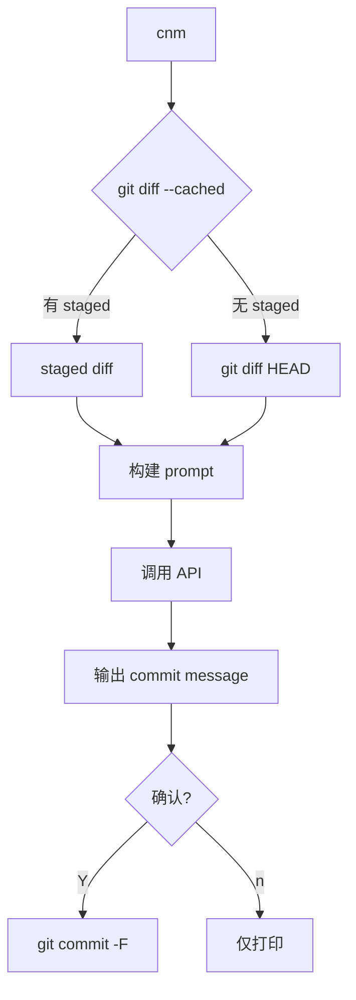

# API 驱动的提交消息生成

## 这个 Epic 要改变什么

把 `cnm` 从「本地模型 + 复杂数据门」方案收缩为 API 驱动的轻量 CLI 工具。用户运行 `cnm`：工具读取 git diff，调用 OpenAI/Anthropic API，生成 commit message，用户确认后提交。

## 为什么现在做

本地模型路径经过 8 次穿刺（#30-#37），14B teacher 的生成和过滤均不可靠，0.5B/1B/2B 直接推理质量不足。同时 Hugging Face 已有他人训练的 commit message 专用模型（git-commit-3B），但中文支持不稳定。维护者决定回到 API 方案——简单、可靠、立即可用。

## 已实现

- `cnm` 单二进制 CLI（8.6MB，851 行 Go），无外部依赖
- `cnm setup` 交互式配置（API key、provider、model、style、custom prompt）
- 配置文件：`~/.config/cnm/config.json`（JSON，权限 0600）
- 7 种内置风格：auto, conventional, angular, google, atom, plain, custom
- 3 种 API 协议：OpenAI Chat Completions, OpenAI Responses, Anthropic Messages
- 配置优先级：CLI flags > 环境变量 > 配置文件 > 默认值
- Staged diff 优先，无 staged 则 fallback 到 HEAD diff
- 多行 commit message 通过 `git commit -F` 保留
- 中文生成实测通过（deepseek-v4-pro）
- 用户确认后提交（--yes 跳过确认）

## 待实现

- [ ] 完整的 npm 打包和发布
- [ ] 安装脚本（curl | sh）
- [ ] Windows/Linux 交叉编译
- [ ] 删除旧代码（TUI, provider runtime, doctor, config center, 旧 CLI）
- [ ] 清理 .codestable/ 和 ADR 文档
- [ ] 更新 README

## 当前方案

## 关联 Vision

- `.cs/vision/index.md`：目标是「简单、小快、轻量、方便」
- 本 Epic 关闭时，毕业到 Project Spec

## 关联 Issues

- [ ] API-based cnm rewrite（待创建）